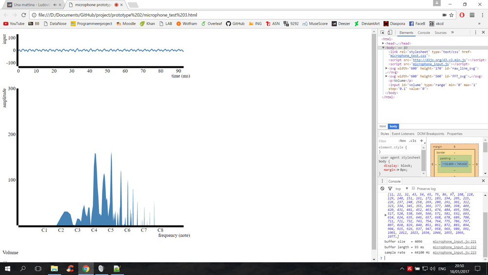
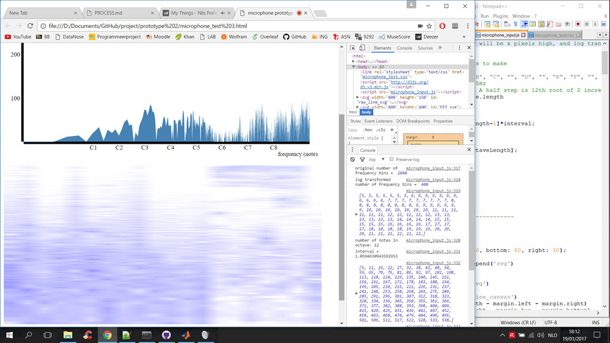
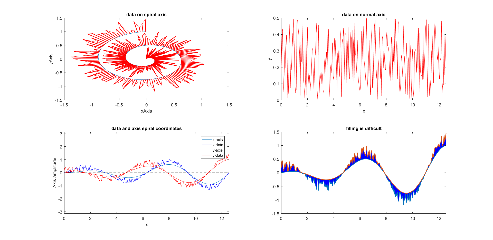
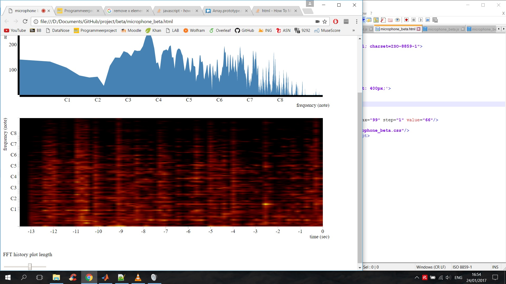

# Process book

Process book for the programming minor eindproject.

> Name: Leander de Kraker 
> Stnr: 10423354 
> Start date: 2017-1-11 

## Week 1. day 3. 2017-1-11

- Finish design file. 
- Look at more examples for audio recording code. 
-  Make my own microphone recording webpage. 

## Week 1, day 4. 2017-1-12

Planned: 
- Take microphone with me, test selection of two audio sources 
- Save microphone recording 
- Fix gain of audio 

Reality:  
- Took microphone with me, selection audio source seems impossible to implement. 
- Fast Fourier Transform audio signal 

## Week 1, day 5. 2017-1-13

Planned: 
- Fast Fourier Transform audio signal 
- Time Fast Fourier Transform 

Reality: 
- We put almost all our time into the presentation 
- Timing doesn't seem to be necissary. 

## Week 2, day 1. 2017-1-16

Planned: 
- Plot buffer output 
Reality: 
- Plotted buffer output! 
- Plotted FFT results 

## Week 2, day 2. 2017-1-17

Planned: 
- Change Plot FFT 

Reality: 
- Looked into data represented in FFT plot.  
- Log transformed x-axis. 
- Calculated note name frequencies. 
- Put note name labels on correct place in FFT plot. 
- Looked into clearing up FFT results with gain. 

## Week 2, day 3. 2017-1-18

Planned: 
- change Plot FFT, Stack plots. 
- Save FFT into matrix and plot heatmap. 

Reality: 
- At home and sick 

## Week 2, day 4. 2017-1-16

Planned: 
- Plot heatmap  
- Add interactivity sliders (gain, zoom, analysis-time) 

Reality:  
- Saved FFT into matrix 
- Plotted heatmap 
- Log transformed heatmap y/freq-axis 

## Week 2, day 5. 2017-1-17

Planned: 
- Add interactivity sliders (gain, zoom, analysis-time) 
- Add axis to heatmap 

Reality: 
- Spent most time for presentation again. 

## Week 3, day 1.

Planned: 
- Add interactivity tick (smoothed view) 
- Implement spiral FFT plot. 
- Add buttons to switch plot type. 

Reality: 
- Trouble with FFT spiral plot and stacking plot 
- Made an implementation for spiral plotting in Matlab 

## Week 3, day 2.

Planned: 
- Spiral FFT plot. 

Reality: 
- Heatmap placement corrected and axis added 
- Correct frequency/y-axis implemented 
- Correct x-axis implemented 
- Zoom slider for heatmap implemented! 

## Week 3, day 3.

Planned:  
- Spiral FFT plot. 

Reality:  
- Fixed small bug that caused heatmap to plot incorrectly and boring.
- Inproved performance of Matlab spiral plot.
- Tried to implement 1-octave per spiral spiral in Matlab, but failed.

## Week 3, day 4.

Planned:  
- Spiral FFT plot. 
- Smoothing signal option. 

Reality:  
- Fixed small bug that caused frequencies in the heatmap to be an octave to low. 
- Made the axis prettier. 
- Implemented stacking of FFT results! 
- Implemented temporal walking average smoothing with switch button! 

## Week 3, day 5.

## Week 4, day 1.

## Week 4, day 2