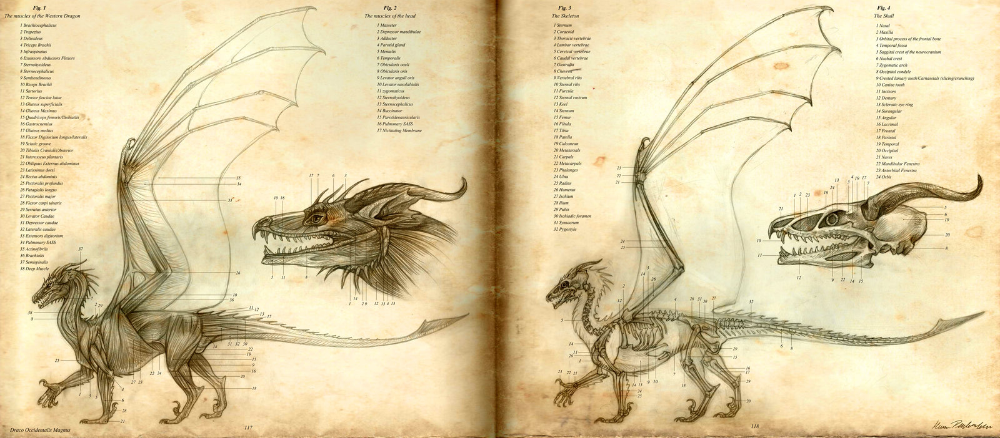

# project

## Problem definition

> He who sees the dragon's voice will know freedom and shall not be burned to a crisp as well.

We need to analyse his mighty roar and wing flapping sounds to not get burned to a crisp.

#### Problem solved for the user:
- How high can I sing?
- How low can I sing?
- Can I sing what I hear?
- Can I sing in tune?
- Do I produce a lot of overtones when I sing?
- Which notes are being played in the music I hear?
- What is the difference in sound spectrum when comparing, guitar, flute, piano and cello for example?

#### What features will be available to solve the problem.

#### Visual sketch of what the application looks like

#### what data sets and data sources will you need, how you will get the data into the right form for your app

#### what separate parts of the application can be defined (decomposing the problem) and how these should work together

#### what external components (APIs) you probably need to make certain features possible

#### technical problems or limitations that could arise during development and what possibilities you have to overcome these

#### a review of similar applications or visualizations in terms of features and technical aspects (what do they offer? how have they implemented it?)