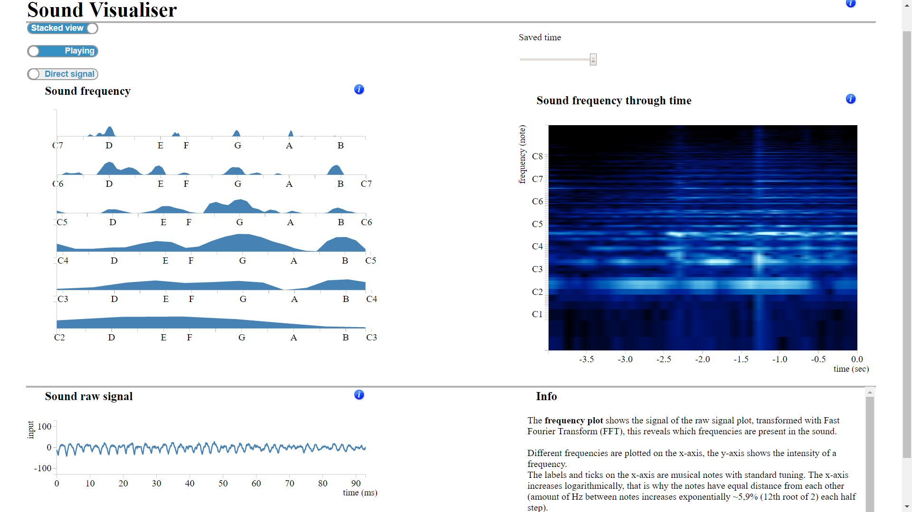
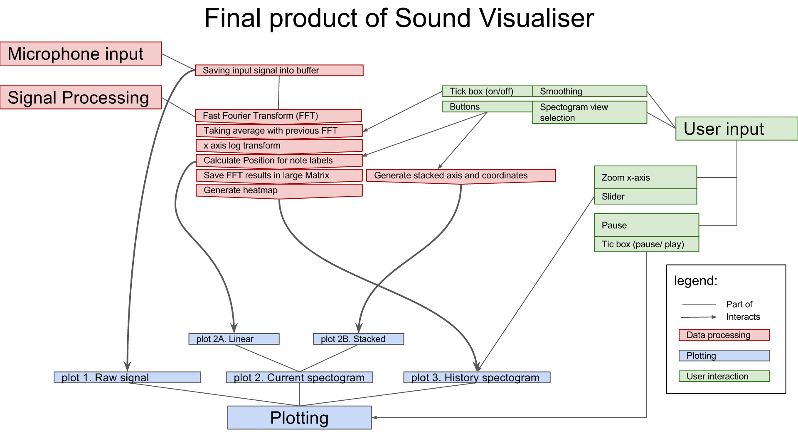

> Name: Leander de Kraker 
> Stnr: 10423354 
> Date: 2017-2-2 

The program uses the user's microphone to visualise the sound signal of the microphone. 
It also applies a Fast Fourier Transformation (FFT), this shows the user which sound frequencies are present in the sound. 
Frequency in Hz is be replaced by note names of musical instruments: A - G. This enables the user to see what notes are being played in music easily.

#### Questions the program can answer for the user.
- How high can I sing?
- How low can I sing?
- Can I sing what I hear?
- Which notes are being played (and when) in the music that I hear?
- What is the difference in sound spectrum when comparing, guitar, flute, piano and cello for example?
- Can I learn how to sing a particular note or note interval? (great potential for relative ear training)

## Technical Design

Overview:

The GetUserMedia API is used to get access to the default microphone of the users' computer.  
Webaudio API is then used to get the audio signal into a buffer and do the FFT. 
D3 is used to create the plots. 
HTML, CSS and javascript work toghether to create the interactivity buttons as you see it on the page. 

####The javascript code: a walkthrough. 
The code begins with initialising variables that are changed with the interactivity buttons, or need to be accessed by the
plotting functions as well as the other parts of the program.  

Then the functions that enable interactivity are added:  

- smoothingToggle: Enables the temporal smoothing (walking average) of the FFT results. Is called by the HTML. 
- pauseChoice: Enables the plots to stop updating. Is called by the HTML. 
- FFTchoice: Enables the switching of stacking and linear FFT view. It also redraws the FFT plot into the new one.
It has to be called in the beginning because otherwise HTML won't see it, but because of this the function does not have access
to the FFT data, so the data will not be redrawn when the plotting is paused :(.

Musical notes frequencies and their names can be computed with code. We need quite a lot of these variables often, so I haven't done it in a function.

- Lin2LogSpace: This function is necessary because an image cannot have a logarithmic axis. So the logtransform of the frequency axis of the heatmap has to be done by
choosing frequency data elements of the FFT array in logarithmic fashion. This function is equivalent the matlab code: round(exp(linspace(log(1), log(max), n))).

D3 PLOTTING functions:
The plot initializing functions.
All initalize plot functions initalize the scales and necessary color functions, it plots the axis and labels on the page.

- init\_raw_plot   
- init\_FFT\_plot_linear   
- init\_FFT\_plot_stacked   
- init\_FFT\_heat_plot   

- redraw\_FFT\_heat_plot: is called when the number of columns is changed of the heatmap, it needs a new x-axis and the x-scale

Plot updating functions (data drawing)

- plot_line: Draws the raw sound input line. 
- plot\_FFT_linear   
- plot\_FFT_stacked: Updates multiple area's, for every plotted octave. 
- plot_heatmap: Creates the image using D3 color functions and places it in canvas.  

AUDIO start. 
The audio context object is made with the WebAudio API. 
Now that the default audio object is created we can extract the sampling frequency of the microphone (44100Hz normally). 
With the sampling frequency The x-axis (time) for the audiobuffer and also the x-axis (frequency) for the FFT resultscan be calculated. 
We need the frequency for each element of the FFT, the time and their minimum and maximum values at different points in the program. 

The log-transformed frequency axis is calculated (with Lin2LogSpace), so specific elements can be used to create a log-transformed axis on the heatmap. 
For the stacking of the octaves the indexes at which a new octave starts need to be searched. By changing the variable _search_ you select a different note to 
cut the octaves on (2 selects B's, 4, selects C#'s etc., each selection causes different amount of shift in the x-axis, because the frequency bins are never the same distance (in Hz) from the exact frequency of the note)

With all the axis properties known the plot initialize functions are called.

Now the variable which will be continuously updated by the WebAudioApi are initialised.

The GetUserMedia version gets checked so there is less chance of a crash.

Now the audio stream is started, this calls start\_microphone. 
start\_microphone creates the required WebAudio nodes to capture the sound into a buffer and do the FFT transform. 
These nodes are connected to each other so they can alter the audio object in the desired way. 
The arrays and matrix in which the FFT results will be saved are created using 8bit integers. The smoothing array is used to temporarily hold the newest FFT results so an average between the newest and the previous 
can be taken. 
One of the nodes has an audioprocess with a custom anonymous function which gets called the entire time.
If the buffer is full, and the pause is not activated, the audio nodes retreive the time domain and frequency domain data. 
Finally, the data for the plots is (re)plotted. 
Even if the pause is activated, the FFT plot is getting (re)plotted, so the data does not dissapear when you switch FFT views while paused.

## Challenges

When I was wondering if my idea was possible to implement I did think of a back-up project. I wanted to create a miniature solar system with the planets orbiting the sun (with orbit eccentricity perhaps? (I don't know about that)) -> click on planet: see moons of planet orbiting in new plot and athmosphere composition -> 
Click on moon: see moon athmosphere composition. Extra option: enable planets to scale (turn all planets into little dots and even the orbits of the moons are too small to see).

It was difficult to understand what happens in the webAudioAPI or getUserMedia. everything on the internet seems to use one example. 

To plot the FFT results with the correct frequency and note names on the axis, I had to calculate and think of all the axis properties and values myself. There were no examples for this. I'm happy with how it turned out.

The D3 plots were quite unique.  
I've used the [very best and only nice D3 heatmap](https://bl.ocks.org/mbostock/3074470) I could find, luckily that one worked for me, although this example starts 
its colormapping at position -1, this causes all color channels to be wrong (expected RGB \(\alpha) -> got \alpha RGB). This can be seen in the WIP picture of week 2 day 4, where I already coded a black to redwhite colormap, that was misinterpreted as a white, blue, invisible colormap. 

The upsides of the spiral plot in [spectratune](http://nasmusicsoft.com/Spectratune.php) are:  
1.  The line is continuous as you would want it, but  
2. because of the circling the axis can be longer than if the axis were straight, so individual notes are able . 
4. It resembles the cochlea, which is awesome and makes it more thought provoking.  
There is not a single example of a D3 spiral area plot, only a [spiral without data](http://bl.ocks.org/syntagmatic/3543186) and a [bar graph spiral](http://54.84.201.59/larsenmtl/222043d93a41d48b58d2bfa1e3d4f708), 
and even that bar graph spiral is using the [spiral without data](http://bl.ocks.org/syntagmatic/3543186) as a base for its code.
I tried to implement the spiral plot using a normal line plot, and calculating the x and y coordinates myself. This worked in Matlab, although even in Matlab it was very hard to fill in the area between the spiral and the dataline (see week 3 day 1).
Even if I was able to plot the spiral in D3 with data, it would not work out as I first intended. 
The number of points in an octave in the FFT increases exponentially, so there have to be some more trickery to get one octave per spiral rotation.

So the spiral plots were cancelled, and I needed a new FFT view. This was easy, since in order to test the FFT plotting and data I already made the 'linear' view, just one x-axis and y-axis for all frequencies.

I think this descision might have made the final product better, because these plots are quite hard for people to understand, and now the FFT plot and heatmap look more like each other, so it is easier to see the link between them.
The stacked FFT plot has the adventage like the spiral plot, that the individual notes are further apart from each other. And the same notes (of different octaves) are all above each other, so you are not missing a lot because of the absent spiral plot.
 
 
Another important decision was to remove some interactivity: the gain slider and microphone selection were cancelled. The gain slider was part of the minimum product. But during the testing I did not see the necessity of it.
The microphone selection seemed downright impossible to implement in javascript. The names of the microphones could not even be retreived correctly. The chance a user has multiple microphones is small to begin with (I think), and 
if it is the case, I've said how you can change which microphone is used in the info of program (change default recording device of your computer).

I also added info buttons that print a lot of info. I think this increases the usability for the viewer a lot.

### If there was more time

1. Add what the maximum ranges of the heatmap time save slider are. 
2. Add labels to the stacked FFT plot (although the label next to the y-axis would have an ambiguous meaning: different octaves? or changing amplitude?)
3. Maybe make the info area a pop-up.

If there was a lot more time I would:

- When the plots are paused, calculate which frequency was the most present in the sound, and print that somewhere.
- Add interactivity between the FFT plot and the heatmap: During hover over over the FFT plot, add a vertical line in the FFT plot, and a horizontal line in the heatmap that is at the same frequency. 
During hover over over the heatmap, add a horizontal line at the heatmap, and a vertical line at the FFT plot at the same frequency.
- Change the color depending on the signal amplitude in the FFT plot (I couldn't find any examples of this..).
- Add a sliding text area under the heatmap that prints the strongest frequency (above a certain threshold), this would be very hard.
